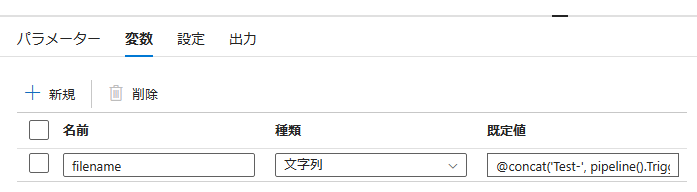
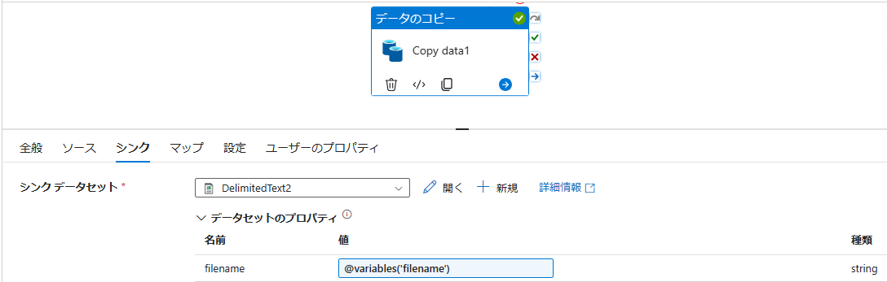

# 概要
シンクにデータを格納する際のファイル名に、実行時の日付やパイプライン実行 ID を加える方法をご紹介いたします。  
ファイル名を操作するために、[データ関数](https://learn.microsoft.com/ja-jp/azure/data-factory/control-flow-expression-language-functions#date-functions) や [システム変数](https://learn.microsoft.com/ja-jp/azure/data-factory/control-flow-system-variables) と [concat 関数](https://learn.microsoft.com/ja-jp/azure/data-factory/control-flow-expression-language-functions#concat) を用いた文字列結合を行うことで実現できます。  

また、[公式ドキュメントの複合式の例](https://learn.microsoft.com/ja-jp/azure/data-factory/control-flow-expression-language-functions#complex-expression-example) も併せてご確認ください。


# 検証環境
- Azure Data Factory V2

# 手順
## 日付をファイル名に含める場合
実行時における日付といった動的なコンテンツを追加するために、今回は [パイプライン式ビルダー] を用います。  
[Datasets] の [ファイルパス] より、[動的なコンテンツの追加] を選択し、[パイプライン式ビルダー] を開きます。

   

実行時のタイムスタンプを得るためには、データ関数の `utcnow()` を使うことで実現できます。また、パイプラインを呼び出したトリガーの実行時刻が必要な場合は、`@pipeline().TriggerTime` を使うことで実現が可能です。  
今回は、下記の複合式を用いました。
```
@concat('Test-', formatDateTime(utcnow(), 'yyyy-MM-dd'), '.csv')
```

   


下記が実行結果となります。設定したシンクである Azure Blob Storage 上のファイル名に日付の情報が含まれていることが確認いただけます。

 


## パイプライン実行 ID をファイル名に加える場合

同様に、[ファイルパス] より [パイプライン式ビルダー] を開きます。パイプラインの実行 ID を取得するには、システム変数の一つである `pipeline().RunId` を使うことで実現できます。  
その他にも、ワークスペースの名前やパイプラインの名前を取得することも可能でございます。詳細は、[システム変数](https://learn.microsoft.com/ja-jp/azure/data-factory/control-flow-system-variables) をご覧ください。  

今回は、下記の複合式を用いました。
```
@concat('Test-', pipeline().RunId, '.csv')
```
   

下記が実行結果となります。確かに、パイプラインの実行 ID がシンクである Azure Blob Storage 上のファイル名に含まれていることが確認できます。

   
   

## パイプラインの変数からファイル名を渡す場合

これまでは、Datasets のファイルパスに書き込む形で実現していましたが、アクティビティの設定から指定する方法で実行します。  
流れとしては、Datasets のパラメータを作成した後、ファイルパスに作成したパラメータを指定します。Datasets のパラメータに対して、アクティビティの設定から、所望の複合式を渡します。その際に、変数として設定しておく方法をご紹介いたします。

まず、[Datasets] の [パラメータ] から任意のパラメータを作成します。[規定値]は、空のままとします。


[ファイルパス] の  [パイプライン式ビルダー] では、作成したパラメータを指定します。
```
@dataset().filename
```

パイプライン キャンパスの背景を選び、[変数] タブを選択して、変数を追加します。




アクティビティを選択し、[シンク] タブより、[シンク データセット] の [データセットのプロパティ] の [値] に、先ほど設定した変数を記入します。変数を呼びだすためには、下記のように `variables()` を用います。  
以上の操作で、シンクに出力されるファイル名に日付を加えることが可能です。
```
@variables('filename')
```


