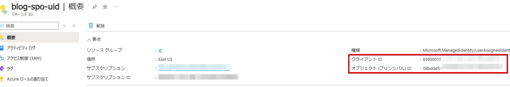
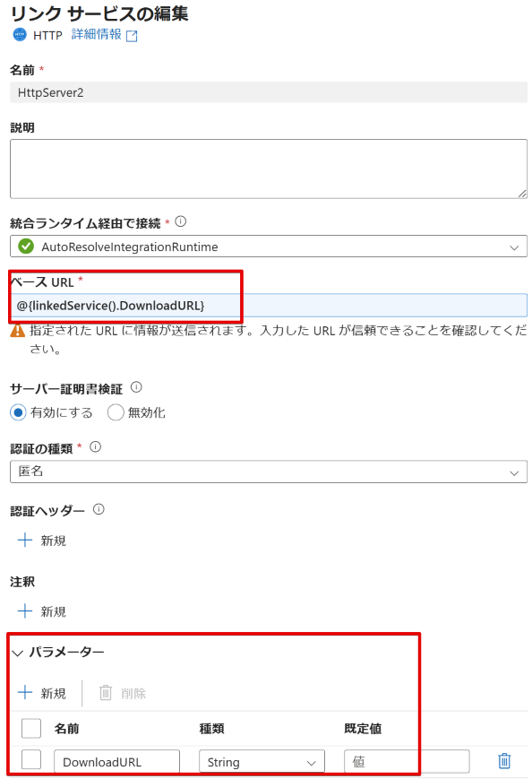

# 概要
Azure Data Factory では、SharePoint Online リストや ファイルをコピーすることが可能です。  
詳細は、[SharePoint コネクタ](https://learn.microsoft.com/ja-jp/azure/data-factory/connector-sharepoint-online-list?tabs=data-factory) の公式ドキュメントをご覧ください。  

しかし、上記ドキュメントにて利用されている **ACS の提供終了計画** により、2026 年 4 月以降はご利用できません。
SharePoint Online リストのデータを取得する場合は、**サービスプリンシパル証明書認証** を代替策としてご利用いただけます。  
    


SharePoint Online 上のファイルをコピーする方法として、Microsoft Graph REST API を用いて方法がございます。本記事では、Graph API を用いて SharePoint Online 上のファイルを Azure Data Lake Storage Gen2 へコピーする方法をご紹介いたします。　　

# 検証環境
- Azure Data Factory V2 
- ユーザー割り当てマネージド ID
- Microsoft Graph REST API


# 手順
## 認証の準備
### ユーザー割り当てマネージド ID の作成 (オプション 1)
本記事では、Microsoft Graph REST API を利用する際の資格情報として、ユーザー割り当てマネージド IDを利用します。  
ユーザー割り当てマネージド ID を作成していない場合は、以下のように Azure ポータル上から作成可能です。  


### ユーザー割り当てマネージド ID の Object ID の確認 (オプション 1)
作成したユーザー割り当てマネージド ID より、**オブジェクト (プリンシパル) ID** をメモします。  



### ユーザー割り当てマネージド ID に権限を付与 (オプション 1)
ユーザー割り当てマネージド ID に対して、SharePoint Online 上のリソースを取得するための権限を付与します。  
任意の端末から、以下の PowerShell コマンドを実行します。
今回は、SharePoint Online サイト上のリソースを読み取り/取得するために [Sites.Read.All](https://learn.microsoft.com/ja-jp/graph/permissions-reference#sitesreadall) 権限を付与しております。

```
Connect-AzureAD -TenantId "<テナントID>"
$ManagedIdentity = Get-AzureADServicePrincipal -ObjectId "<ユーザー割り当てマネージド ID のオブジェクト (プリンシパル) ID>"
$GraphAPI = Get-AzureADServicePrincipal -Filter "DisplayName eq 'Microsoft Graph'"
$SitesReadAll = $GraphAPI.AppRoles | where Value -like 'Sites.Read.All'

New-AzureADServiceAppRoleAssignment  -Id $SitesReadAll.Id  -ObjectId $ManagedIdentity.ObjectId  -PrincipalId $ManagedIdentity.ObjectId  -ResourceId $GraphAPI.ObjectId
```
　　
### Azure Data Factory Studio 上でユーザー割り当てマネージド ID の登録 (オプション 1)
Azure Data Factory 上で、権限を付与したユーザー割り当てマネージド ID が利用できるように登録を行います。  
[Azure Data Factory Studio](https://adf.azure.com/) を開いていただき、[管理] > [資格情報] > [+ 新規] から作成いたします。設定する項目は以下の通りです。  
  
|  項目  |  値  |
| ---- | ---- |
|  種類  |  User-assigned managed identity  |
|  Azure サブスクリプション  |  作成したユーザー割り当てマネージド ID を選択します  |
|  ユーザー割り当てマネージド ID  | 作成したユーザー割り当てマネージド ID を選択します  |
  


### アプリケーションの登録 (オプション 2)
ユーザー 割り当てマネージド ID を用いない方法といたしまして、[アプリの登録] よりアプリケーションを作成いただき、サービス プリンシパル認証を行う方法がございます。  
作成したアプリケーションの [アプリケーション ID] および [ディレクトリ (テナント) ID] を控えておきます。  


### サービス プリンシパルに権限を付与 (オプション 2)
サービス プリンシパルに Share Point Online のサイトから情報を取得するための権限を割り振ります。  
[API のアクセス許可] から、「Microsoft Graph」における「Sites.Read.All」を付与します。  


### サービス プリンシパル キーの作成 (オプション 2-1)
パイプラインにて、サービス プリンシパル キーを用いて認証を行う場合は、上記画像の [証明書とシークレット] より、シークレット キーの作成を行います。  

### サービス プリンシパル 証明書の作成 (オプション 2-2)
パイプラインにて、サービス プリンシパル 証明書を用いて認証を行う場合は、上記画像の [証明書とシークレット] より、証明書の登録を行います。  
証明書の作成および証明書を base64 でエンコードする手順は以下となります。  
  

1. 証明書の作成  
[公開証明書を作成してエクスポートする](https://learn.microsoft.com/ja-jp/entra/identity-platform/howto-create-self-signed-certificate#create-and-export-your-public-certificate) を参考に、証明書の作成を行います。  

2. 証明書のアップロード
作成した証明書をサービス プリンシパルに登録します。
  

3. 証明書の内容をbase-64形式に変換  
[HDInsight でサービス プリンシパル証明書の内容を base-64 でエンコードされた文字列形式に変換する](https://learn.microsoft.com/ja-jp/azure/hdinsight/hadoop/hdinsight-troubleshoot-converting-service-principal-certificate#resolution) を参考に、証明書の内容を base-64 形式に変換します。
  


## パイプラインを作成する
Microsoft Graph REST API を使用して、コピーに必要な ダウンロード URL を取得するための Web アクティビティと コピー アクティビティを作成します。  
パイプラインの全体図は以下の通りです。


今回のパイプラインでは、対象の SharePoint Online のドキュメント フォルダ配下にある input.xlsx ファイルを対象とします。


### Get SiteID Web アクティビティ

接続したい SharePoint Online サイトの サイト ID を取得します。  
[サイト リソースを取得する](https://learn.microsoft.com/ja-jp/graph/api/site-get?view=graph-rest-1.0&tabs=http#example-2-get-a-site-by-server-relative-url) を参考に、Web アクティビティでは以下のように設定します。  
オプション 1 と 2 のそれぞれの指定方法は以下の通りです。  これ以降はオプション 1 を基準に記載いたします。

<ユーザー割り当てマネージド ID を用いる場合>  
  
|  項目  |  値  |
| ---- | ---- |
|  URL  |  https://graph.microsoft.com/v1.0/sites/<SharePoint Online のドメイン名>.sharepoint.com:/sites/<サイト名>  |
|  メソッド  |  GET  |
|  認証  | ユーザー割り当てマネージド ID  |
|  リソース  | https://graph.microsoft.com   |
|  資格情報  | Azure Data Factory Studio で登録したユーザー割り当てマネージド ID の資格情報 |　　
  
  　　


<サービス プリンシパル キーを用いる場合>  
  
|  項目  |  値  |
| ---- | ---- |
|  認証  | サービス プリンシパル  |
|  テナント  | アプリケーションの登録におけるディレクトリ (テナント) ID   |
|  サービス プリンシパル ID  | アプリケーションの登録におけるアプリケーション ID |  
|  サービス プリンシパル資格情報の種類  | サービス プリンシパル キー |  
|  サービス プリンシパル キー  | [証明書とシークレット] にて作成したシークレット キーの値 |  

  
  
<サービス プリンシパル 証明書を用いる場合>  
  
|  項目  |  値  |
| ---- | ---- |
|  認証  | サービス プリンシパル  |
|  テナント  | アプリケーションの登録におけるディレクトリ (テナント) ID   |
|  サービス プリンシパル ID  | アプリケーションの登録におけるアプリケーション ID |  
|  サービス プリンシパル資格情報の種類  | サービス プリンシパル証明書 |  
|  サービス プリンシパル証明書  | base64 でエンコードした証明書の内容 |  
  

   

    
    
Web アクティビティの実行出力より、**id** が取得できていることを確認します。

　　

### Get DriveID Web アクティビティ

接続したい SharePoint Online サイトに紐づく Drive ID を取得します。  
[サイトのドライブを一覧表示する](https://learn.microsoft.com/ja-jp/graph/api/drive-list?view=graph-rest-1.0&tabs=http#list-a-sites-drives) を参考に、Web アクティビティでは以下のように設定します。

先ほど取得したサイト ID を利用するため、URL には以下のように Get SiteID Web アクティビティの出力を利用するように記載します。Web アクティビティ名が異なる場合は、アクティビティ名と揃えてください。
```
@concat('https://graph.microsoft.com/v1.0/sites/'
    ,activity('Get SiteID').output.id
    ,'/drives'
)
```
  

|  項目  |  値  |
| ---- | ---- |
|  URL  |  [動的なコンテンツを追加] より、上記を記載 |
|  メソッド  |  GET  |
|  認証  | ユーザー割り当てマネージド ID  |
|  リソース  | https://graph.microsoft.com   |
|  資格情報  | Azure Data Factory Studio で登録したユーザー割り当てマネージド ID の資格情報 |


Web アクティビティの実行出力より、**value 配列** が取得できていることを確認します。こちらの配列の中から、必要な要素をフィルターします。


### Filter1 Fileter アクティビティ
必要な Document ドライブの情報のみを抽出します。以下の通り、設定します。  
こちらも前のアクティビティの出力結果を利用しますので、必要に応じてアクティビティ名を修正してください。

```
項目
@activity('Get DriveID').output.value

条件
@equals(item().name,'Documents')
```

|  項目  |  値  |
| ---- | ---- |
|  項目  |  [動的なコンテンツを追加] より、上記を記載 |
|  条件  |  [動的なコンテンツを追加] より、上記を記載  |


### Get File Web アクティビティ
取得したいファイルの ダウンロード URL を取得します。  


今回は、`input.xlsx` を取得するため `/root:/input.xlsx` と記載しております。  
`test` フォルダ配下にある場合は、`/root:/test/input.xlsx` のように指定します。
```
@concat(
    'https://graph.microsoft.com/v1.0/sites/'
    ,activity('Get SiteID').output.id
    ,'/drives/'
    ,activity('Filter1').output.value[0].id
    ,'/root:/input.xlsx'    
)
```

|  項目  |  値  |
| ---- | ---- |
|  URL  |  [動的なコンテンツを追加] より、上記を記載 |
|  メソッド  |  GET  |
|  認証  | ユーザー割り当てマネージド ID  |
|  リソース  | https://graph.microsoft.com   |
|  資格情報  | Azure Data Factory Studio で登録したユーザー割り当てマネージド ID の資格情報 |

Web アクティビティの実行出力より、**@microsoft.graph.downloadUrl** が取得できていることを確認します。


### Copy アクティビティ
Get File Web アクティビティで得られた `@microsoft.graph.downloadUrl` を接続先として、コピー アクティビティを作成します。  
ソースは、HTTP コネクタを利用しますが、以下の画像のように [ベース URL] は動的に変化するため、パラメーター化しておきます。

  

同様に、データセットの作成画面では、リンク サービスのパラメーターを埋める UI が表示されますが、パイプライン編集画面から指定するために、　　
データセットのパラメーターを [パラメーター] タブより作成しておき、データセットのパラメーターを指定します。


パイプラインの編集画面にて、[ソース] > [ソース データセット] > [データセットのプロパティ] が表示されますので、以下のように `@microsoft.graph.downloadUrl` を指定します。
```
@activity('Get File').output['@microsoft.graph.downloadUrl']
```  


設定は以上となります。　　
