>注意：
>[C. Azure Data Factory から SharePoint Online サイトへの接続の準備](#c-azure-data-factory-から-sharepoint-online-サイトへの接続の準備)で説明されているSharePoint アプリのアクセス許可の機能はすでに廃止となっており、2026 年 4 月 2 日には完全に使用できなくなります。詳しくは以下のドキュメントをご覧ください（英語のみ）。
>[Azure ACS retirement in Microsoft 365 | Microsoft Learn](https://learn.microsoft.com/en-us/sharepoint/dev/sp-add-ins/retirement-announcement-for-azure-acs)

<!-- omit in toc -->
## 目次

- [前提条件](#前提条件)
- [参考ドキュメント](#参考ドキュメント)
- [A. Microsoft ID プラットフォームにアプリケーション (SharePoint Online) を登録する](#a-microsoft-id-プラットフォームにアプリケーション-sharepoint-online-を登録する)
- [B. アプリケーションのクライアントシークレットの追加](#b-アプリケーションのクライアントシークレットの追加)
- [C. Azure Data Factory から SharePoint Online サイトへの接続の準備](#c-azure-data-factory-から-sharepoint-online-サイトへの接続の準備)
- [D. Azure Data Factory で SharePoint Online リストへのリンク サービスを作成する](#d-azure-data-factory-で-sharepoint-online-リストへのリンク-サービスを作成する)
- [E. Azure Data Factory で SharePoint Online リストのデータセットを作成する](#e-azure-data-factory-で-sharepoint-online-リストのデータセットを作成する)
- [F. Azure Data Factory で Blob ストレージへのリンクサービスを作成する](#f-azure-data-factory-で-blob-ストレージへのリンクサービスを作成する)
- [G. Azure Data Factory でシンクの Blob ファイルのデータセットを作成する](#g-azure-data-factory-でシンクの-blob-ファイルのデータセットを作成する)
- [H. Data Factory で SharePoint リストから Blob ファイルへのデータコピーアクティビティを作成する](#h-data-factory-で-sharepoint-リストから-blob-ファイルへのデータコピーアクティビティを作成する)
- [I. パイプラインの実行と結果の確認](#i-パイプラインの実行と結果の確認)

## 前提条件

- Azure Data Factory を作成済みであること。
- ストレージアカウントを作成済みであること。
- SharePoint Online のリストを作成済みであること。

## 参考ドキュメント

- [SharePoint Online リストからデータをコピーする - Azure Data Factory & Azure Synapse | Microsoft Learn](https://learn.microsoft.com/ja-jp/azure/data-factory/connector-sharepoint-online-list?tabs=data-factory)
- [クイック スタート: Microsoft ID プラットフォームでアプリを登録する - Microsoft identity platform | Microsoft Learn](https://learn.microsoft.com/ja-jp/entra/identity-platform/quickstart-register-app)

## A. Microsoft ID プラットフォームにアプリケーション (SharePoint Online) を登録する

まずは接続先となる SharePoint をアプリケーションとして登録し、Data Factory から接続する準備をします。

__1) クラウド アプリケーション管理者の権限を持つユーザで、[Microsoft - Microsoft Entra 管理センター](https://entra.microsoft.com/#home)にアクセスします__  
複数のテナントにアクセスできる場合は、上部のメニューの [設定] アイコンを使い、
[ディレクトリとサブスクリプション] メニューから SharePoint を登録するテナントに切り替えます。
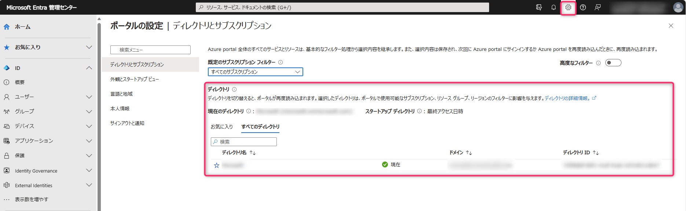

__2) [ID] > [アプリケーション] > [アプリの登録] に移動し、 [新規登録] を選びます__  
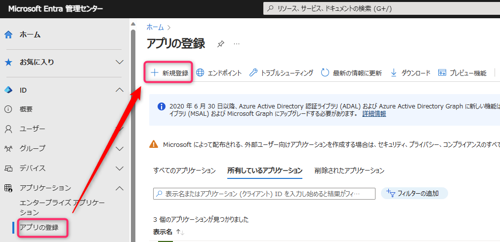

__3) Data Factory の接続先となる SharePoint の表示名を入力します__  
表示名はサインイン時など、アプリケーションのユーザーがアプリを使用するときに表示されることがあります。  表示名はいつでも変更できます。  
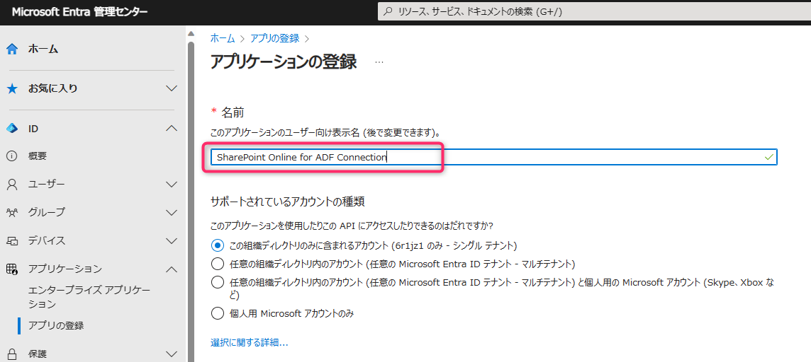

__4) [サポートされているアカウントの種類] では SharePoint に接続することのできるユーザー（アプリケーションを含む）を指定します__  
各項目の説明は [こちらのドキュメント] (https://learn.microsoft.com/ja-jp/entra/identity-platform/quickstart-register-app#register-an-application)をご覧ください。
テナントをまたがって Data Factory から SharePoint に接続を行うような場合は、マルチテナントの選択肢を選んでください。
[リダイレクト URI (省略可能)] などその他の項目の入力は今回のケースでは不要です。
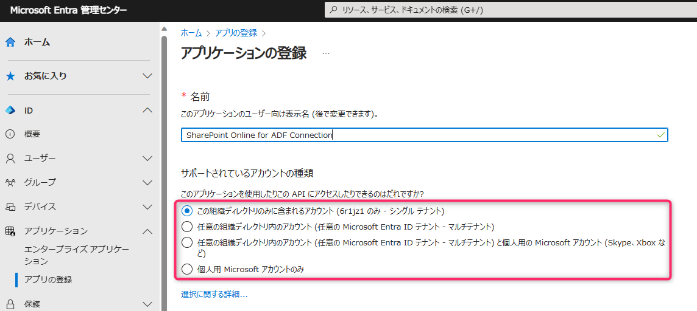

__5) [登録] をクリックして、アプリ登録を完了します__  
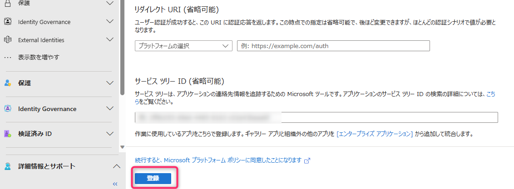

登録が完了すると、Microsoft Entra 管理センターにアプリの登録の[概要]ペインが表示されます。
[アプリケーション (クライアント) ID] の値を確認します。 この値は、"クライアント ID" とも呼ばれ、
Microsoft ID プラットフォーム内のアプリケーションを一意に識別します。

__6) この画面で表示される [アプリケーション（クライアント） ID] 、 [ディレクトリ（テナント） ID] をメモしておきます__  
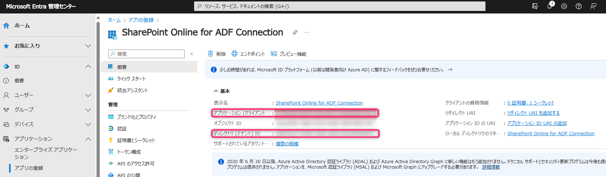

## B. アプリケーションのクライアントシークレットの追加

__1) 先ほどの画面から [証明書とシークレット] > [クライアント シークレット] > [新しいクライアント シークレット] を選択します__  
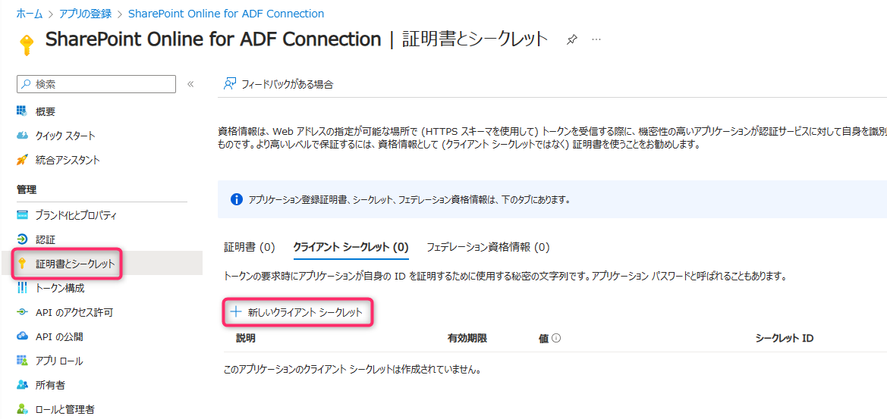

__2) クライアント シークレットの説明を追加します__  
シークレットの有効期限を選択するか、カスタムの有効期間を指定します。  
[追加] を選択します。  
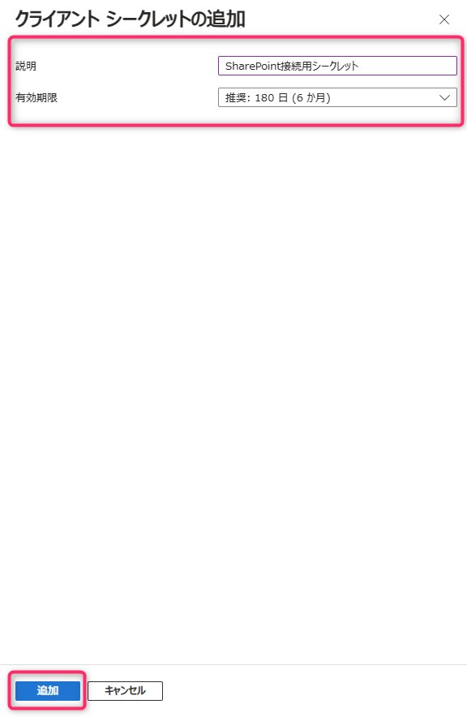

__3) クライアント アプリケーションのコードで使用できるようにシークレットの値をコピーしておきます__  
    **このページから離れるとこのシークレットの値は 二度と表示されません。**  
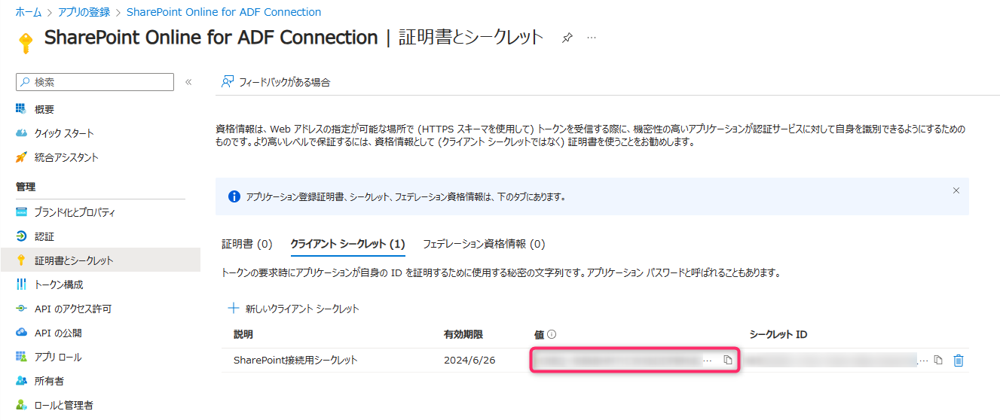

## C. Azure Data Factory から SharePoint Online サイトへの接続の準備

__1) 接続先の SharePoint Online でアクセス許可を設定します__  
https://[your_site_url]/_layouts/15/appinv.aspx を開きます。
([your_site_url] の部分はお使いの SharePoint Online の URL に置き換えてください。)

先ほどの手順でメモしたアプリケーション ID を空欄に入力します。
[参照] をクリックすると設定した SharePoint Online の表示名が自動で入力されます。
その他の項目は以下のように入力します。

| 設定項目 | 入力内容 |
| :- | :- |
| アプリドメイン | localhost.com （今回のケースではダミーを使用します） |
| リダイレクト URL | <https://www.localhost.com>（今回のケースではダミーを使用します） |

権限の要求 XML には以下の内容をコピー & ペーストで入力します。

```xml
<AppPermissionRequests AllowAppOnlyPolicy="true">
    <AppPermissionRequest Scope="http://sharepoint/content/sitecollection/web" Right="Read"/>
</AppPermissionRequests>
```

__2) [作成] をクリックします__  
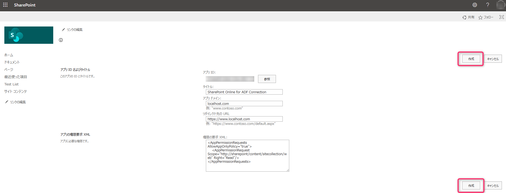

__3) [信頼する] をクリックします__  
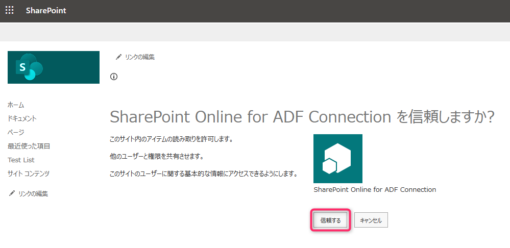

## D. Azure Data Factory で SharePoint Online リストへのリンク サービスを作成する

__1) Azure Data Factory の [管理] メニューに移動し、 [リンク サービス] を選択して、 [新規] をクリックします__  
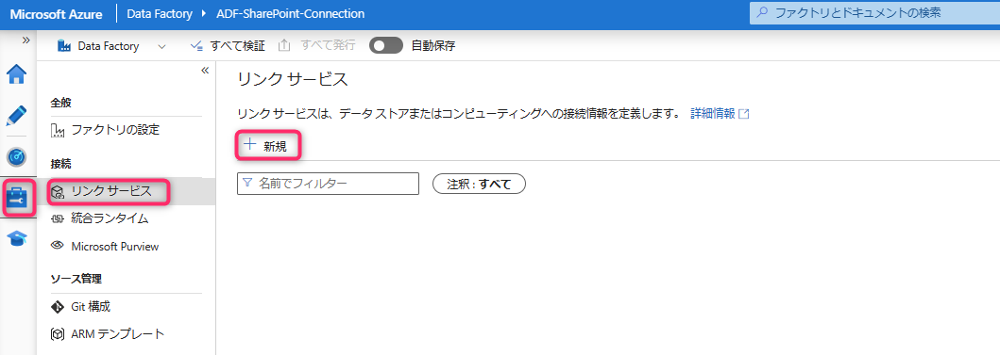

__2) SharePoint を検索し、[SharePoint Online リスト] コネクタを選択します__  
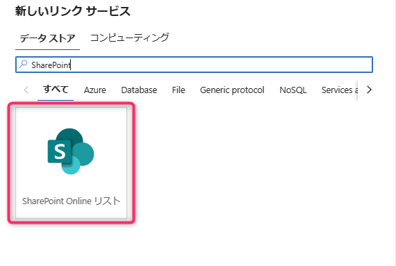

__3) 入力フィールドに情報を入力して、テスト接続を行います__  
サイト URL には接続対象の SharePoint サイトの URL を入力します。
テナント ID、サービスプリンシパル ID、サービスプリンシパル キーには前の手順で登録した
テナント ID、アプリケーション ID、シークレット値をそれぞれ記入します。
入力が済んだら [テスト接続] をクリックして、 SharePoint との接続を確認します。
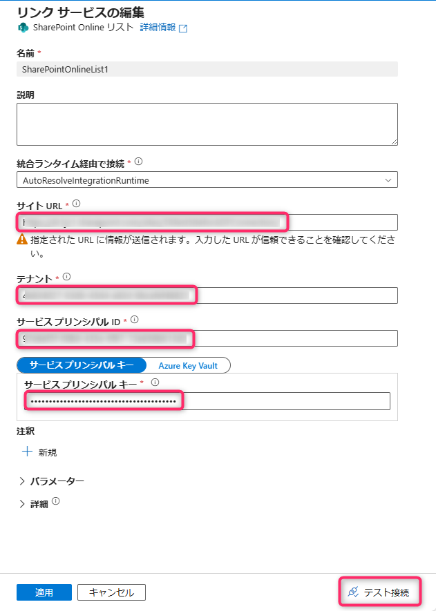

接続が成功したら [適用] をクリックしてリンク サービスを作成します。

## E. Azure Data Factory で SharePoint Online リストのデータセットを作成する

__1) [作成者] アイコン → [データセット] → […] メニュー → [新しいデータセット] から接続先（SharePoint）のデータセットを作成します__  
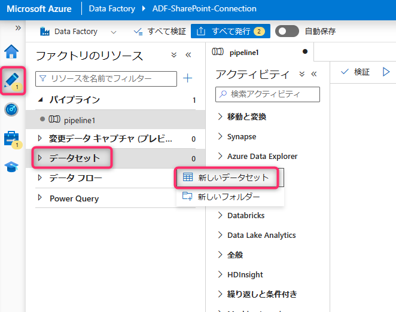

__2) [SharePoint Online リスト] を選択して、[続行] をクリックします__  
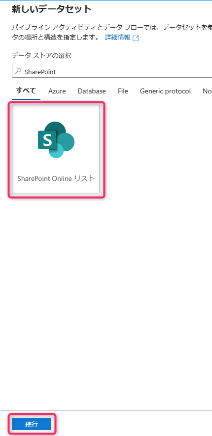

__3) 入力フィールドに必要な情報を入力して [OK] を選択します__  
任意の名前を入力し、先ほどの手順で作成したリンクサービスを選択します。
さらにコピー対象となる SharePoint のリスト名を選択して [OK] をクリックします。  
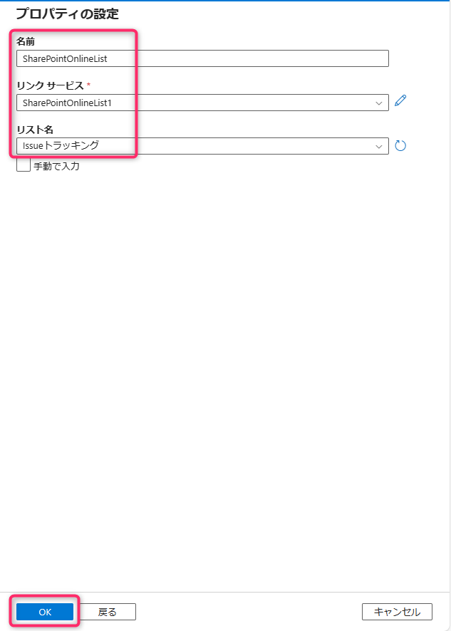

## F. Azure Data Factory で Blob ストレージへのリンクサービスを作成する

>今回の例では出力先をAzure BLOB ストレージの任意のディレクトリとします。
>ストレージの作成方法等については、[ストレージ アカウントを作成する] (https://learn.microsoft.com/ja-jp/azure/storage/common/storage-account-create?tabs=azure-portal)をご覧ください。

__1) Azure Data Factory の [管理] タブに移動し、[リンク サービス] を選択して、 [新規] をクリックします__  


__2) Azure BLOB ストレージを選択し、[続行] をクリックします__  
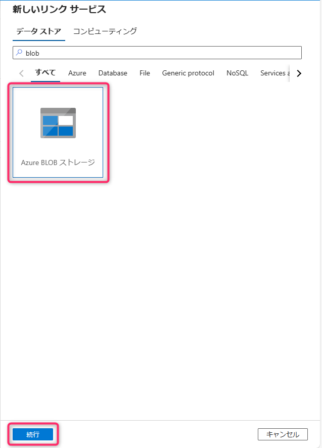


__3) 必要な情報を入力し、テスト接続ができることを確認します__  
任意の名前を入力し、出力先となるストレージアカウントを選択します。
テスト接続を行い、成功したら、[作成] をクリックします。
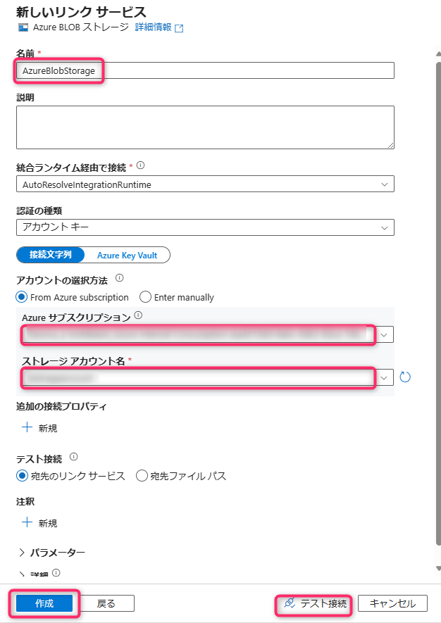

## G. Azure Data Factory でシンクの Blob ファイルのデータセットを作成する

__1) [作成者] アイコン → データセット右の […] メニュー → 新しいデータセットから接続先のデータセットを作成します__  


__2) Azure BLOB ストレージを選択して、 [続行] をクリックします__  
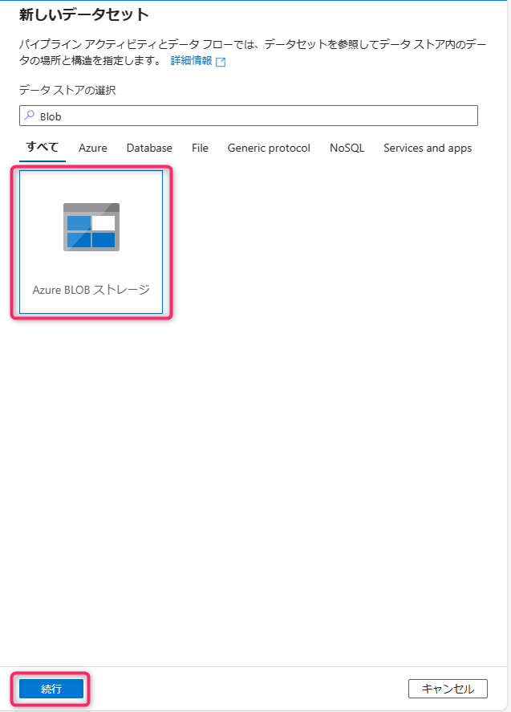

__3) 出力形式は "DelimitedText" を選択して、 [続行] をクリックします__  
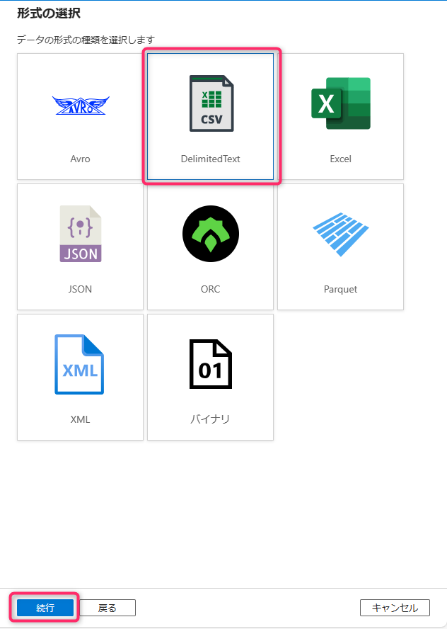

__4) 必要な情報を入力し、データセットを作成します__  
任意の名前を入力し、先の手順で作成したリンクサービスを選びます。
ファイルパスは任意の Blob ストレージのパスを入力します。
[先頭行をヘッダーとして] のチェックはそのままで [OK] をクリックします。
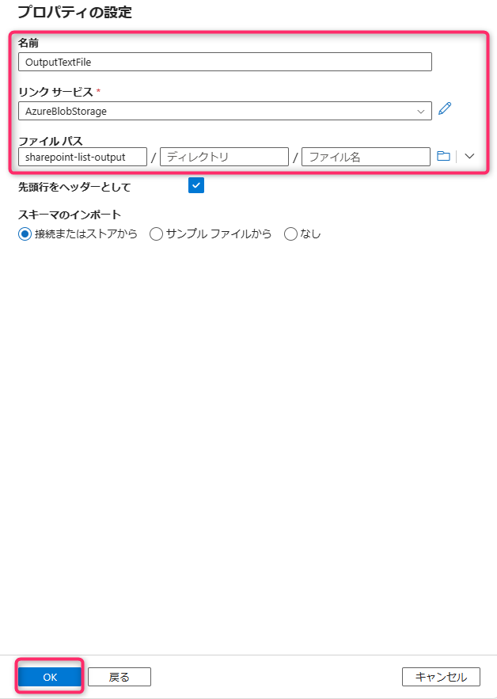

## H. Data Factory で SharePoint リストから Blob ファイルへのデータコピーアクティビティを作成する

__1) 新規にパイプラインを作成し、アクティビティの [移動と変換] から [データのコピー] アクティビティを選び、キャンバスにドラッグ & ドロップで配置します__  
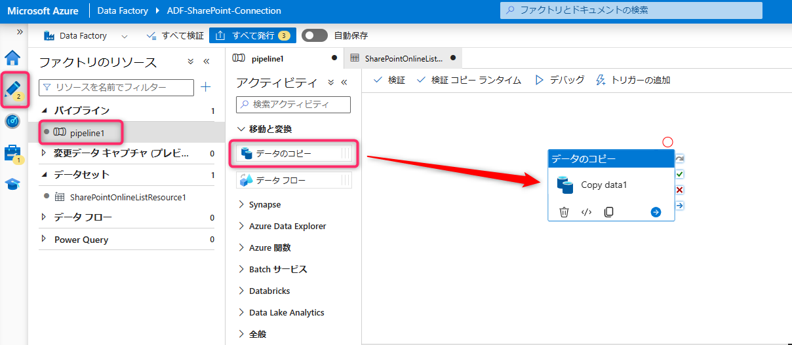

__2) ソース タブで先ほど作成した、SharePoint のデータセットを選びます__  
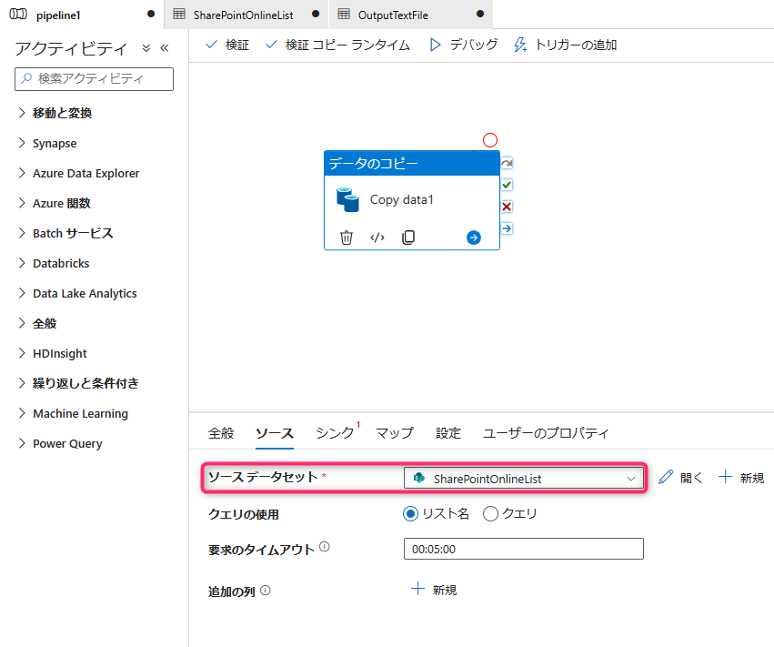

__3) 次にシンク タブで先ほど作成した Blob ストレージのデータセットを選びます__  
また、必要に応じて他の項目も設定します。
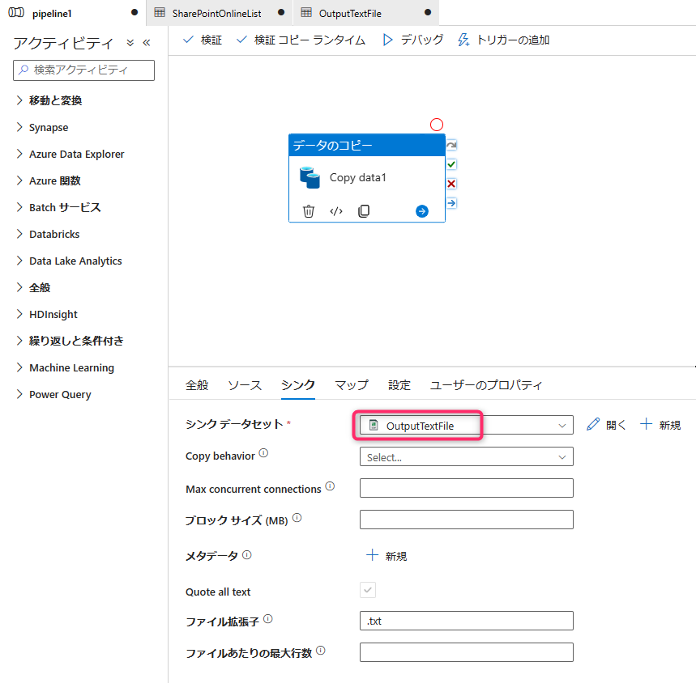

## I. パイプラインの実行と結果の確認

__1) 上記の設定が完了したら、[トリガーの追加] → [今すぐトリガー] で実行します__  
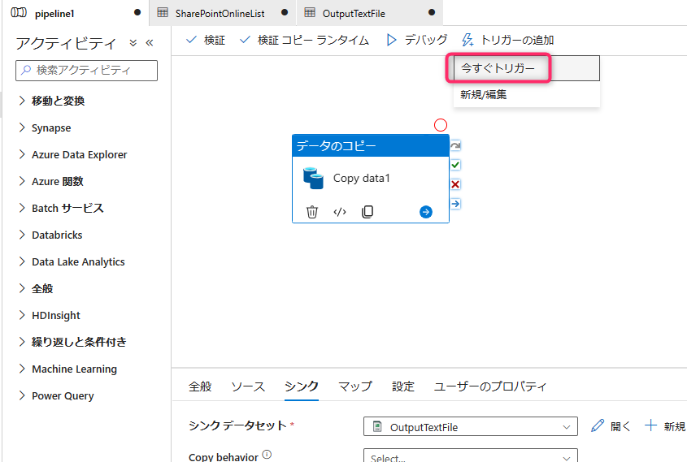

__2) 画面一番左の [モニター] メニューの [パイプライン実行] で先ほどトリガー実行したパイプラインの結果を確認することが可能です__  
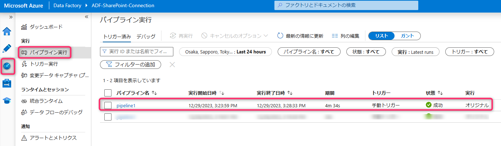

また、シンクの Blob ストレージで出力されたファイルを確認することも可能です。  
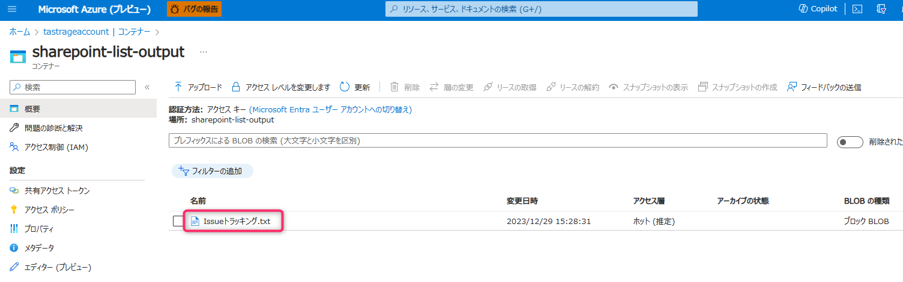