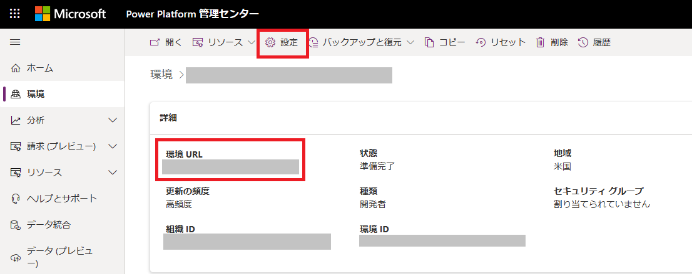
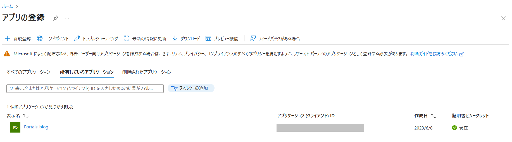

# 目次
- [目次](#目次)
- [概要](#概要)
- [検証環境](#検証環境)
- [手順](#手順)
  - [Dataverse 側の接続権限付与](#dataverse-側の接続権限付与)
  - [Data Factory 側の接続情報取得 ( リンクサービスの作成 )](#data-factory-側の接続情報取得--リンクサービスの作成-)

# 概要
サービスプリンシパル認証を使った Data Factory とDataverse  のリンクサービスの作成方法についてご紹介いたします。作成するにあたり、アプリに関する情報の取得と Dataverse 側でのアクセス権限の付与が必要になります。  
[Dataverse コネクタの公式ドキュメント](https://learn.microsoft.com/ja-jp/azure/data-factory/connector-dynamics-crm-office-365?tabs=data-factory) も併せてご確認ください。  

# 検証環境
- Azure Data Factory V2

# 手順

## Dataverse 側の接続権限付与

Azure AD 登録済みアプリケーションから Dataverse にアクセスするには Office 365 側の アプリ ユーザーが必要です。
以下の手順で新しいアプリ ユーザーを作成します。   
[Power Platform 管理センターでアプリケーション ユーザーを管理する](https://learn.microsoft.com/ja-jp/power-platform/admin/manage-application-users#create-an-application-user) も併せてご確認ください。 

[Power Platform 管理センター](https://admin.powerplatform.microsoft.com/home) にシステム管理者でアクセスします。  
「環境」 から該当する環境を選択します。

環境URL を取得しておきます。Azure Data Factory のリンクサービスを作る際の、サービスURLの一部になります。  
「設定」 を選択します。

 「ユーザーとアクセス許可」 を選択してから、「アプリケーション ユーザー」 を選択します。

 「+ 新規アプリ ユーザー」 を選択し、新しいアプリ ユーザーの作成ページを開きます。  
 「部署」 で、ドロップダウン リストから部署を選択した後、 「セキュリティ ロール」 の 「編集」 を選択します。  
 新しいアプリケーション ユーザーに追加する選択した部署のセキュリティ ロールを選択できます。「システム管理者」 などのセキュリティ ロールを追加した後、「保存」 を選択します。

## Data Factory 側の接続情報取得 ( リンクサービスの作成 )
Azure AD 登録されているアプリケーションの情報を取得する必要があります。  
Azure Portal より 「アプリの登録」から確認できます。今回は、Portals-blog が該当します。

サービスプリンシパル認証に必要なIDとKeyを取得します。
サービスプリンシパルID は、「アプリ情報」 -> 「概要」 -> 「アプリケーションID」 で取得できます。

サービスプリンシパルKey は、「アプリ情報」 -> 「証明書とシークレット」 -> 「クライアントシークレット」 で取得もしくは作成できます。  
[!IMPORTANT]
作成直後を除き、クライアント シークレットの値を表示できません。ページを終了する前に、必ず保存してください。  

得られた情報から、Azure Data Factory 上でリンクサービスの作成を行います。サービスURI は、Power Platform 管理センター で得られた環境URL を用います。必要に応じて、https://  などを加えてください。

