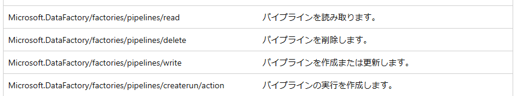
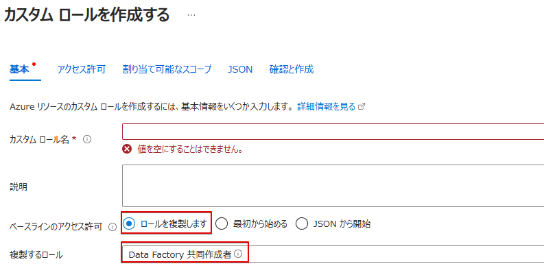
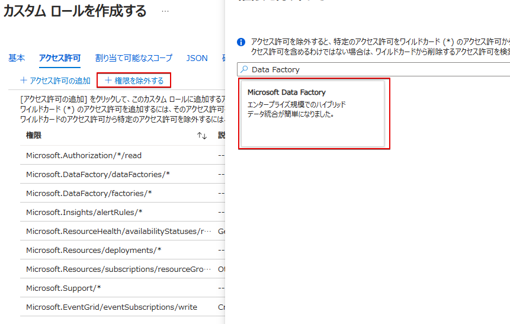
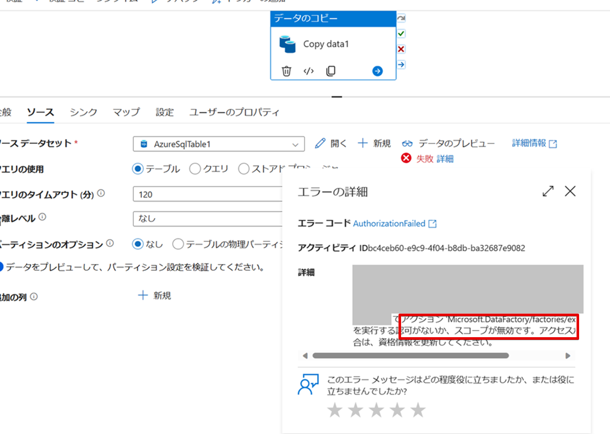
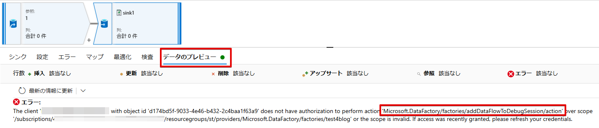
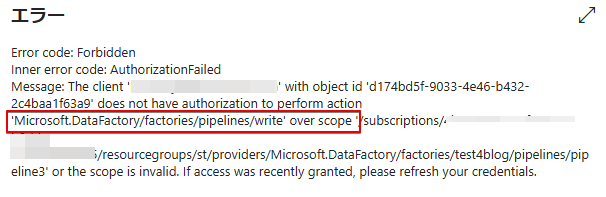
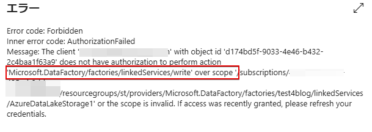

# 概要
この記事では、カスタム ロール を使用して Azure Data Factory Studio におけるユーザーの操作 (データのプレビュー、パイプラインの作成、リンク サービスの作成) に制限を加える方法について説明します。  


# 検証環境
- Azure Data Factory V2  


# Azure のロール
  

## カスタム ロールの作成方法
Azure では、組み込みで提供されているロールの他に、ユーザーで独自のカスタム ロールを作成することが可能です。  
組み込みロールと同様に、カスタム ロールは、ユーザー、グループ、サービス プリンシパルに対して、管理グループ、サブスクリプション、およびリソース グループのスコープで割り当てることができます。

カスタム ロールの作成手順につきましては、公式ドキュメントの [Azure portal を使用して Azure カスタム ロールを作成または更新する](https://learn.microsoft.com/ja-jp/azure/role-based-access-control/custom-roles-portal) をご覧ください。


## Azure Data Factory の組み込みロール
Azure Data Factory の組み込みロールとして、**「Data Factory 共同作成者」** ロールが提供されています。  
**「Data Factory 共同作成者」** ロールで提供されている各権限につきましては、 [Azure 組み込みロール - Data Factory Contributor](https://learn.microsoft.com/ja-jp/azure/role-based-access-control/built-in-roles/analytics#data-factory-contributor) および [Microsoft.DataFactory](https://learn.microsoft.com/ja-jp/azure/role-based-access-control/permissions/analytics#microsoftdatafactory) ドキュメントをご覧ください。  
なお、上記のドキュメントにて 「Microsoft.DataFactory/dataFactories/*」 は、既に廃止されている Azure Data Factory V1 向けになりますので、カスタム ロールを作成される際は考慮していただく必要はございません。
  


# カスタム ロールによる制限のシナリオ
以下に、よくある利用例としてのカスタム ロールをご紹介いたします。  
組み込みロールである **「Data Factory 共同作成者」** ロールを基本に、制限したいアクションに該当する権限を **NotAction** に追加いたします。  
作成後、制限したいユーザーにカスタム ロールを付与します。なお、反映までに数分かかる場合がございます。
  
  


また、[Azure Data Factory のロールとアクセス許可](https://learn.microsoft.com/ja-jp/azure/data-factory/concepts-roles-permissions#custom-scenarios-and-custom-roles) ドキュメントも併せてご覧ください。

## データのプレビューを制限する
既存のパイプラインに設定されているアクティビティでは、[データのプレビュー] を押下することで、
接続先のデータを確認することが可能です。  
こちらの操作をユーザーに操作させたくない場合は、以下の 3 つの権限を NotActions に追加します。
```
"notActions": [
                    "Microsoft.DataFactory/factories/getFeatureValue/read",
                    "Microsoft.DataFactory/factories/getDataPlaneAccess/action",
                    "Microsoft.DataFactory/factories/addDataFlowToDebugSession/action"
                ],
```

上記のカスタム ロールを付与されたユーザーが、[データのプレビュー] を押下すると、　　
以下のような権限が不足しているエラーを確認することが可能です。  
  

データ フローの [データのプレビュー] でも同様のエラーをご確認いただけます。  
  


## パイプラインの新規作成および制限を制限する
既存のパイプラインの編集や新規のパイプラインの作成を制限されたい場合は、以下の権限を NotActions に追加いたします。

```
"notActions": [
                    "Microsoft.DataFactory/factories/pipelines/write"
                ]
```  
  
  
以下のように、操作を行う権限が不足しているエラーを確認できます。
  


## リンク サービスの新規作成および編集を制限する
既存のリンク サービスの編集や新規のリンク サービスの作成を制限されたい場合は、以下の権限を NotActions に追加いたします。


```
"notActions": [
                    "Microsoft.DataFactory/factories/linkedServices/write"
                ]
```        

以下のように、操作を行う権限が不足しているエラーを確認できます。
  


