# 目次
- [目次](#目次)
- [概要](#概要)
- [検証環境](#検証環境)
- [手順](#手順)
  - [REST API の準備](#rest-api-の準備)
  - [Data Flow の準備](#data-flow-の準備)
  - [外部呼び出しの設定](#外部呼び出しの設定)
    - [REST のリンクサービスの作成](#rest-のリンクサービスの作成)
    - [呼び出し変換の設定](#呼び出し変換の設定)
    - [Mapping の設定](#mapping-の設定)
    - [Output の設定](#output-の設定)
  - [外部呼ぶ出しの実行結果の確認](#外部呼ぶ出しの実行結果の確認)
- [ご紹介していない機能について](#ご紹介していない機能について)
  - [行によって適用するAPI を変えたいとき](#行によって適用するapi-を変えたいとき)
  - [Response をデータに加えたいとき](#response-をデータに加えたいとき)


# 概要

Data Flowにおける外部呼び出し変換を使用すると、外部のREST API を行単位で適用することが可能です。  
この記事では、投稿日時点での機能を用いて、外部呼び出しの使用例をご紹介します。  
[外部呼び出しの公式ドキュメント](https://learn.microsoft.com/ja-jp/azure/data-factory/data-flow-external-call) も併せてご確認ください。
この記事では、一枚目にあるデータの各行のデータをbody として、外部のAPI にPOST します。最後に、その他の例についても簡単にはなりますが、記載いたします。

POST する前のデータ
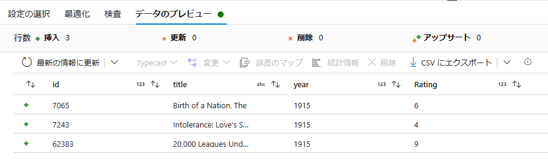    

POST した後のデータ
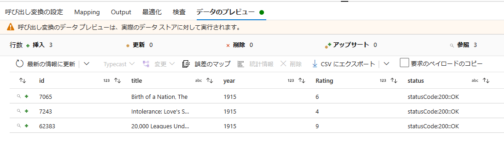

一行目の id=7065 の行をbody としてPOST した結果  
`{'id': 7065, 'title': 'Birth of a Nation, The', 'year': 1915, 'Rating': 6}`
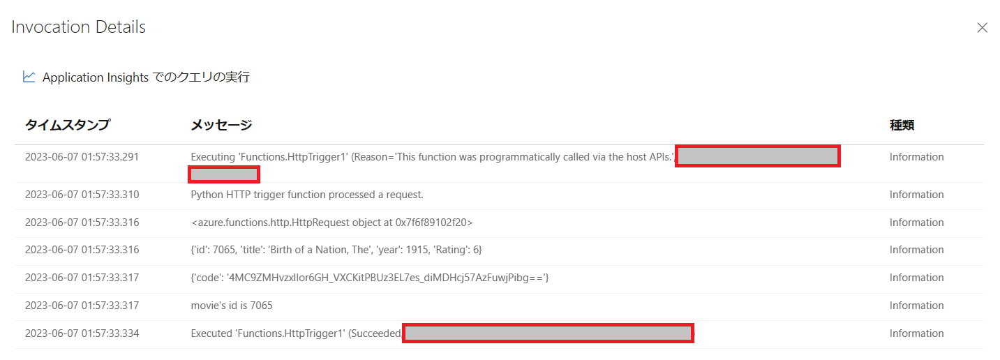

# 検証環境
- Azure Data Factory V2 Data Flow
- Azure Functions (REST API用)
  
# 手順
## REST API の準備
Data Flow から外部呼び出しを行うAPI の準備をします。  
Azure Functions を用いて、Data Flow から外部呼び出しどのように行われているか確認するため、受け取ったリクエストをログに吐き出すだけのAPI を作成します。  

ここでは、下記のようなpython での関数で検証を行います。
```
import logging

import azure.functions as func


def main(req: func.HttpRequest) -> func.HttpResponse:
    logging.info('Python HTTP trigger function processed a request.')
    logging.info(req)
    logging.info(req.get_json())  # bodyの内容をログに吐き出す
    logging.info(req.params)
    
    req_body = req.get_json()
    movie_id = req_body.get('id')
    logging.info(f"movie's id is {movie_id}")
    return func.HttpResponse(
            "This HTTP triggered function executed successfully. ",
            status_code=200)
```

保存を行い、関数URL の取得を行います。
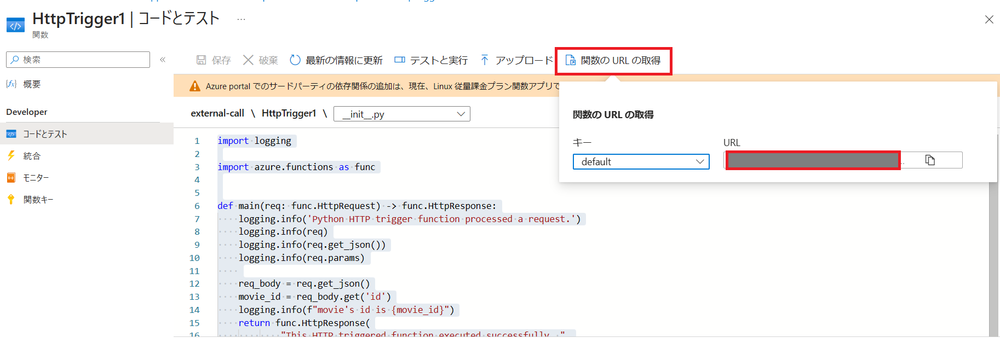  

## Data Flow の準備

外部呼び出しを含むData Flow を作成しました。
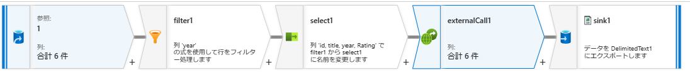  

外部呼び出しは、スキーマ修飾子 の中にあります。  
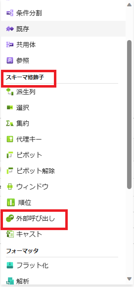  


## 外部呼び出しの設定

### REST のリンクサービスの作成
  

ベースURL に、Azure Functions で取得したURLを入れ、接続を行います。
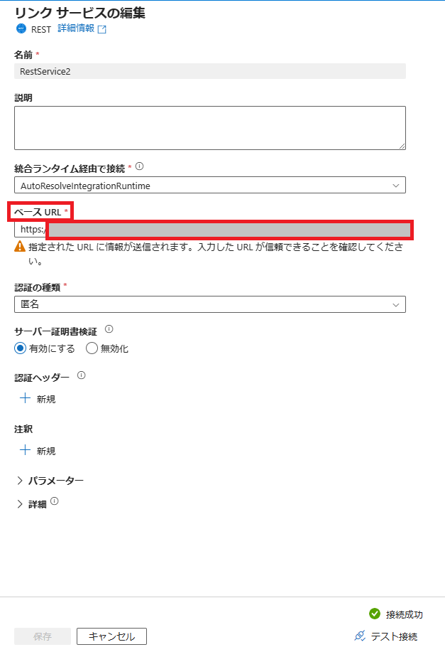  


### 呼び出し変換の設定

API をたたく際のリンクサービスやヘッダー、API のカスタマイズ等を行います。  
本検証では各項目を以下のとおり設定しております。実行する API に応じて適宜設定いただきますようお願い致します。  
現時点では、REST のみがサポートされています。

要求メソッド：POST  
要求書式：JSON  
要求JSON設定：未設定  
応答書式：JSON  
応答JSON設定：単一のドキュメント

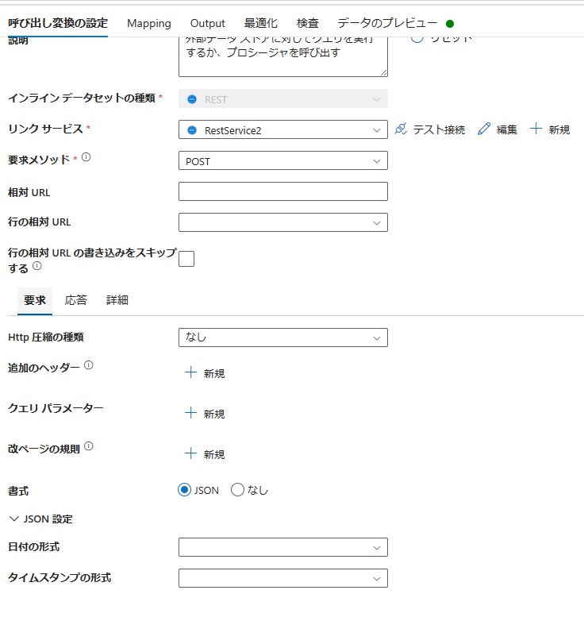  

### Mapping の設定
ここでは、bodyに関する設定を行います。bodyに含めたい列とkey名を指定します。  
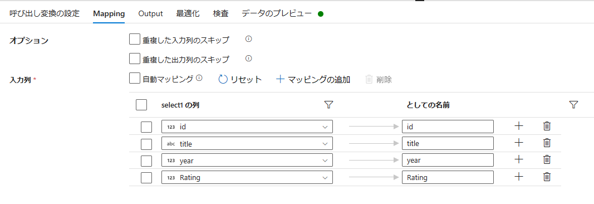  

### Output の設定
POST したResponse に関して設定を行います。  
今回は、POST が成功したかどうかの状態のみを設定します。  
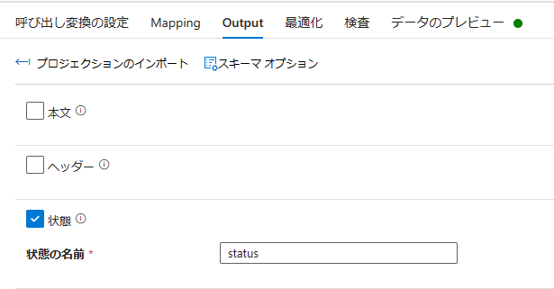  

## 外部呼ぶ出しの実行結果の確認

下記のように、データのプレビューから、最新の情報に更新を行うことで、実際にPOST をして結果を確認できます。status が200番が帰っており、API を正常に叩けていることが確認できました。  

 

Azure Functions 側のログから、どのようにリクエストが飛んできたか確認できます。


# ご紹介していない機能について
上記のサンプルでは、使用していない項目についてご紹介します。  
英語にはなりますが、詳細は、[外部呼び出しの公式ドキュメント](https://learn.microsoft.com/ja-jp/azure/data-factory/data-flow-external-call) にございます動画をご覧ください。

## 行によって適用するAPI を変えたいとき
公式ドキュメントの動画内にあるとおり、呼び出し変換の設定 -> 行の相対URL に対象の列を指定することで解決できます。  
動画では、派生列変換を用いて、リンクサービスで指定したベースURL に続く相対URL のための列(ziplookup)を生成しております。  
その後、外部呼び出し変換の行の相対URL にて列をしてしております。

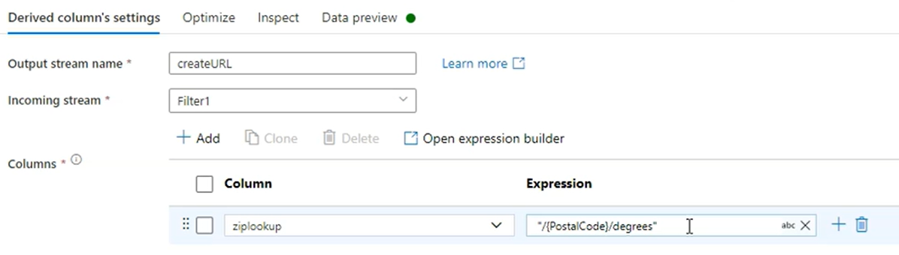 
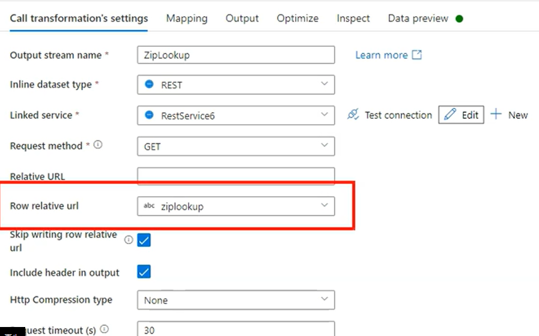 

## Response をデータに加えたいとき
API のResponse をデータフローのデータの中に含めたい場合は、上述のOutPut の設定を行います。本文にチェックボックスを加えて、Response のkey名と型についての定義が必要です。

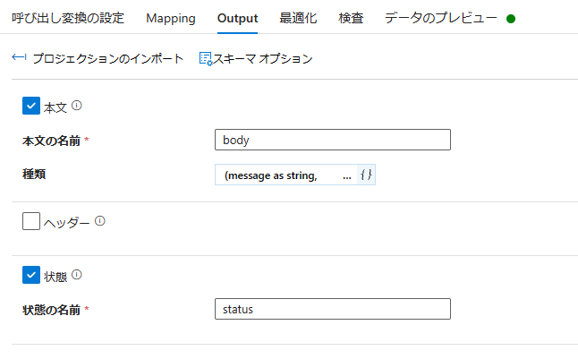 
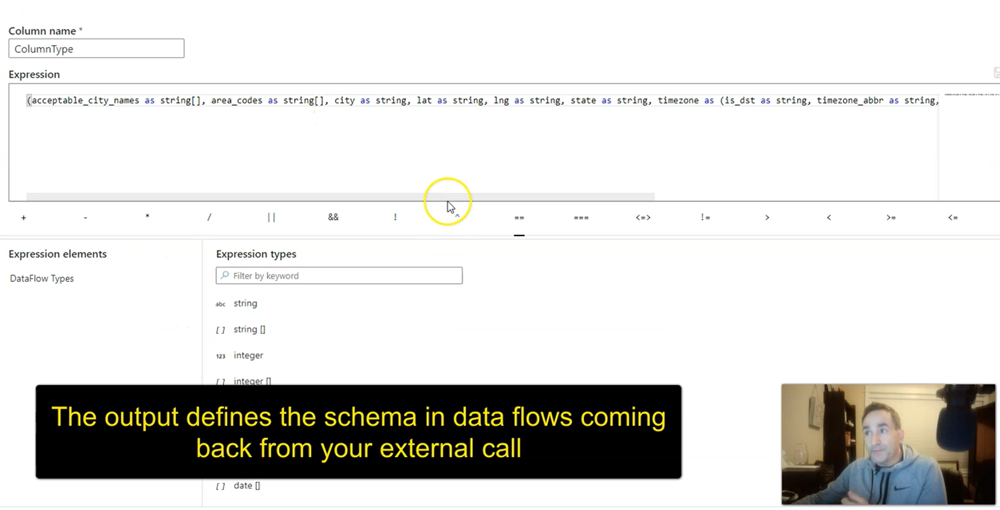 
