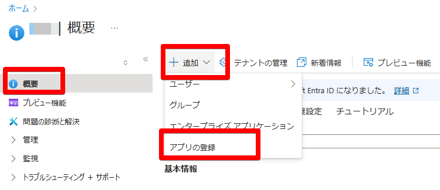
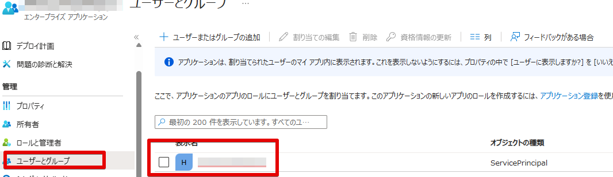
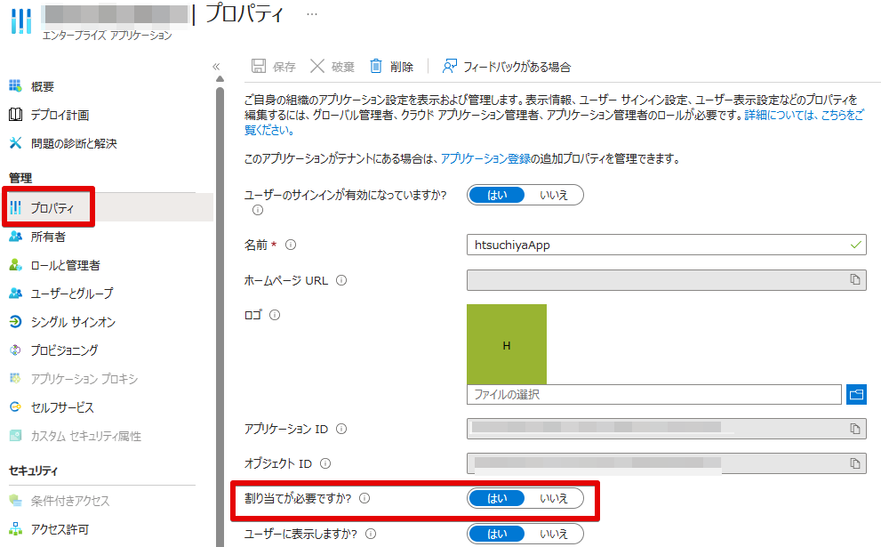
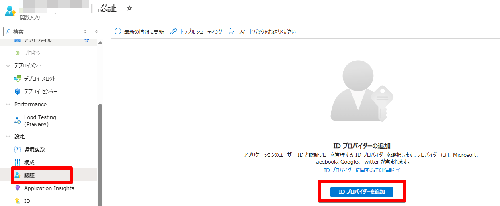
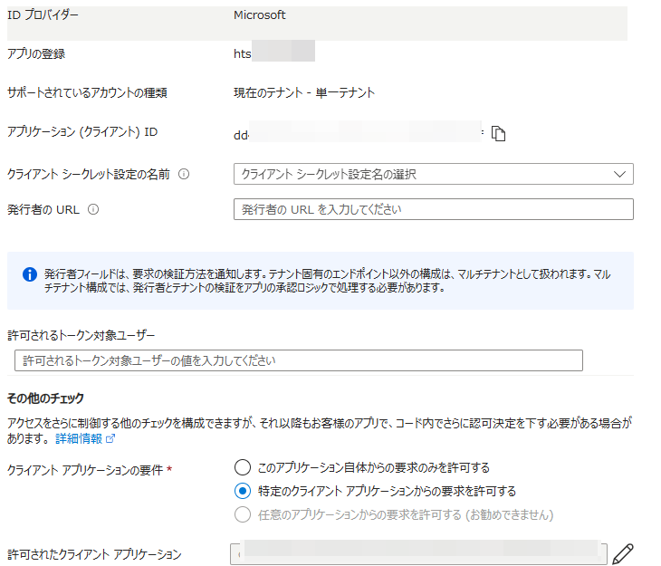
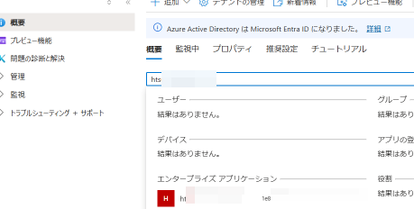
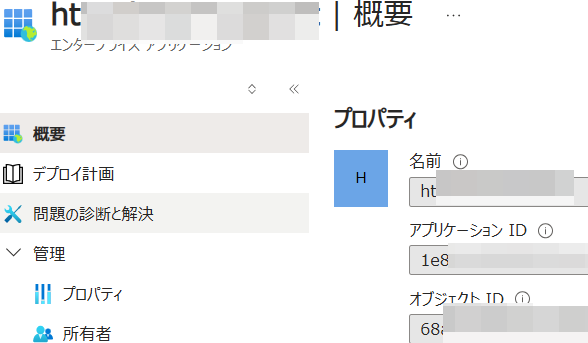
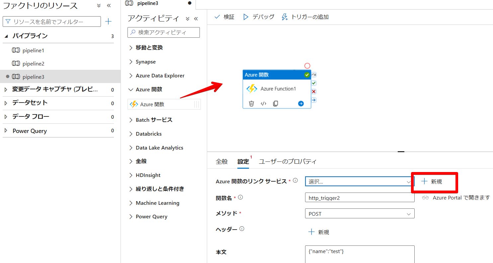
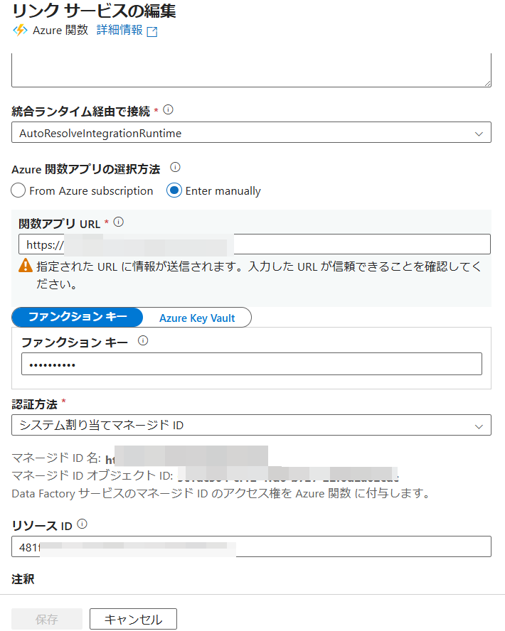

# 概要
この記事では、システム割り当てマネージド ID を使用して Azure Data Factory から Azure 関数を呼び出す方法について説明します。

# 検証環境
- Azure Data Factory V2
- Azure Functions 

# 手順

## 手順 1 アプリケーションの登録および設定を行う

### 手順 1.1 (未作成の場合) アプリケーションの登録を行う
Azure ポータルにて、[Microsoft Entra ID] と検索いただき、  
[+ 追加] > [アプリの登録] よりアプリの作成を行います。
名前を記載いただき、特別な理由がなければ規定値のまま進めます。



作成後に表示される「アプリケーション (クライアント) ID」をメモします。  


### 手順 1.2 アプリケーションのロールを作成する
Azure ポータルにて [アプリの登録] を開きます。
[アプリ ロール] > [アプリ ロールの作成] を押下いただき、新規にロールを作成いたします。  

|  項目  |  値  |
| ---- | ---- |
|  表示名  |  ご自由に設定ください  |
|  許可されたメンバーの種類 |  アプリケーション  |
|  値  |  ご自由に設定いただけますが、後ほど使用します  |
|  説明  |  ご自由に設定ください |



### 手順 1.3 マネージド ID にアプリ ロールを付与する
事前に権限を割り振れるかどうか確認いたします。
[エンタープライズ アプリケーション] より、該当のアプリケーションを選択ください。  
[プロパティ] より、「割り当てが必要ですか?」が有効になっていることを確認します。

  
    
その後、Azure Cloud Shell や PowerShell を用いて以下のコマンドを実行いたします。  
AzureAD モジュールを用いるサンプル プログラムを記載しておりますが、[AzureAD モジュール 公式ドキュメント](https://learn.microsoft.com/ja-jp/powershell/azure/active-directory/install-adv2?view=azureadps-2.0) にて、2024 年 3 月 30 日をもって、非推奨プランとなっている点にご留意ください。

```
Connect-AzureAD
$MSI = Get-AzureADServicePrincipal -Filter "displayName eq '<datafactory-name>'" 
$funapp = Get-AzureADServicePrincipal -Filter "displayName eq '<aad-appName>'"
$PermissionName = "<手順1.2 で設定した「値」を記載ください。>"　
$approle = $funapp.AppRoles | Where-Object {$_.Value -eq $PermissionName}
New-AzureADServiceAppRoleAssignment -ObjectId $MSI.ObjectId -PrincipalId $MSI.ObjectId -ResourceId $funapp.ObjectId -Id $approle.Id
```

AzureAD モジュールがご要望に沿わない場合は、後続モジュールである Microsoft Graph PowerShell をご利用ください。  
こちらの場合は、以下のようなサンプル プログラムとなります。

```
Connect-MgGraph -Scopes 'AppRoleAssignment.ReadWrite.All'
$MSI = Get-MgServicePrincipal -Filter "displayName eq '<datafactory-name>'"
$funapp = Get-MgServicePrincipal -Filter "displayName eq '<aad-appName>'"
$PermissionName = "<手順1.2 で設定した「値」を記載ください。>"　
$approle = $funapp.AppRoles | Where-Object {$_.Value -eq $PermissionName}
 
$params = @{
principalId = $MSI.Id
resourceId = $funapp.Id
appRoleId = $approle.Id
}
 
New-MgServicePrincipalAppRoleAssignment -ServicePrincipalId $MSI.Id -BodyParameter $params
```

### 手順 1.4 ロールの割り当てを確認する
[エンタープライズ アプリケーション] より、該当のアプリケーションを選択ください。  
[ユーザーとグループ] より、ご利用の Azure Data Factory 名で追加されているかご確認ください。
[](./how-to-use-sami-auth4functions/how-to-use-sami-auth4functions-5.png)
  

## 手順 2 Azure 関数の認証設定を行う
### 手順 2.1 認証にてアプリケーションを追加する

ご利用の Azure 関数の [認証] > [ID プロバイダーを追加] を開きます。


以下画像のように設定いたします。  
特筆すべき点を以下の表に記載しております。  

|  項目  |  値  |
| ---- | ---- |
|  ID プロバイダー  |  Microsoft  |
|  アプリの登録  |  既存アプリの登録の詳細を提供します  |
|  アプリケーション (クライアント) ID  |  2.1 で作成したアプリのアプリケーション (クライアント) ID  |
|  クライアント アプリケーションの要件  |  「このアプリケーション自体からの要求のみを許可する」もしくは 「特定のクライアント アプリケーションからの要求を許可する」 |
|  許可されたクライアント アプリケーション (特定のクライアント アプリケーションからの要求を許可する を選択した場合) |  Azure Data Factory のマネージド ID の**アプリケーション (クライアント) ID** |
|  認証されていない要求  |  HTTP 401 認可されていない: API に推奨  |




なお、Azure Data Factory のマネージド ID のアプリケーション (クライアント) ID は、以下にてご確認いただけます。  

Azure ポータルより「Microsoft Entra ID」と検索いただき、
検索ボックスにて、ご利用の Azure Data Factory 名を検索いたします。  


該当の Azure Data Factory をクリックいただくことで、「アプリケーション ID」をご確認いただけます。



## 手順 3 Azure Data Factory の Azure 関数 アクティビティの設定
Azure Data Factory Studio を開き、Azure 関数 アクティビティの設定を行います。  
Azure 関数アクティビティをドラッグアンドドロップした後、[設定] > [Azure 関数のリンク サービス] > [+ 新規] を選択します。
  

  
接続先の関数アプリを選択いただき、[認証方法] を「システム割り当てマネージド ID」を選択し、[リソース ID] には手順 2.1 および手順 2.2 で登録したアプリケーションのクライアント ID を設定します。
詳細な設定項目につきましては、公式ドキュメントの [Azure Functions のリンクされたサービス](https://learn.microsoft.com/ja-jp/azure/data-factory/control-flow-azure-function-activity#azure-function-linked-service) もご覧ください。

  

以上の設定で完了です。